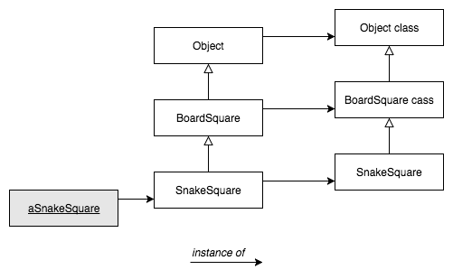
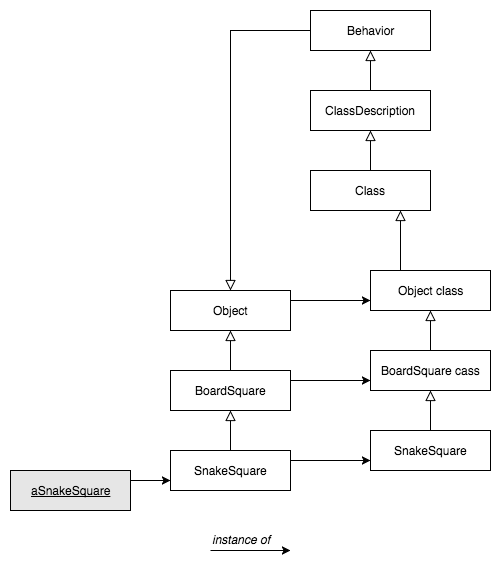
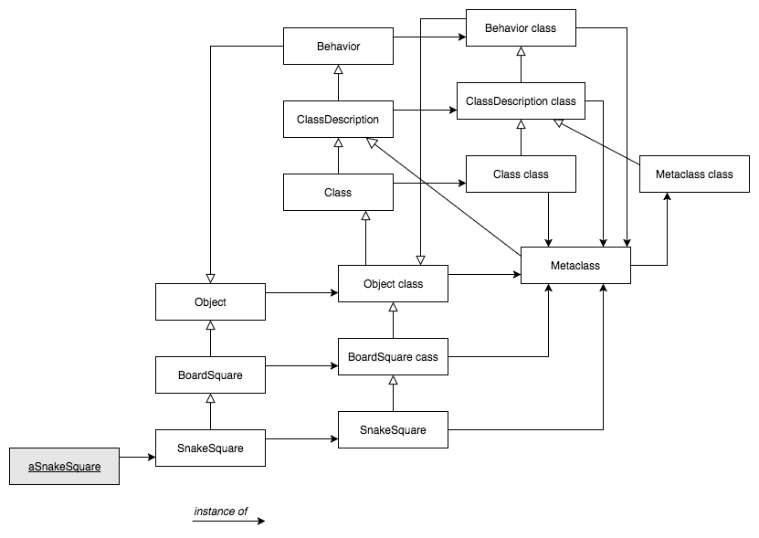

# Reflexió

- [Definició](https://github.com/felixarpa/CAP-Reflexio/tree/master/reflexio#definició)
- [Fonaments](https://github.com/felixarpa/CAP-Reflexio/tree/master/reflexio#fonaments)
	- [Reflexio](https://github.com/felixarpa/CAP-Reflexio/tree/master/reflexio#reflexio-1)
	- [Introspecció](https://github.com/felixarpa/CAP-Reflexio/tree/master/reflexio#introspecció)
	- [Intercessió](https://github.com/felixarpa/CAP-Reflexio/tree/master/reflexio#intercessió)
	- [Sistemes reflexius](https://github.com/felixarpa/CAP-Reflexio/tree/master/reflexio#sistemes-reflexius)
	- [Reflexió estructural](https://github.com/felixarpa/CAP-Reflexio/tree/master/reflexio#reflexió-estructural)
	- [Reflexió de comportament](https://github.com/felixarpa/CAP-Reflexio/tree/master/reflexio#reflexió-de-comportament)
- [Reflexió en Smalltalk](https://github.com/felixarpa/CAP-Reflexio/tree/master/reflexio#reflexió-en-smalltalk)
	- [Les Mestaclasses en 7 parts](https://github.com/felixarpa/CAP-Reflexio/tree/master/reflexio#les-mestaclasses-en-7-parts)
	- [Classes Indexades i Variables d’Instància](https://github.com/felixarpa/CAP-Reflexio/tree/master/reflexio#classes-indexades-i-variables-d-instància)

## Definició

Habilitat d'un programa a examinar-se, modificar la seva estructura i el seu comportament en temps d'execusió. És l'estudi de (les conseqüències de) l'**auto-referència** en els llenguatges de programació.

### Exemples d'auto-referència

#### Recursivitat

```c++
int fib(int n) {
    if (n == 0) return 0;
    if (n == 1) return 1;
    return fib(n - 2) + fib(n - 1);
}
```

#### Quines

Una *Quine* és un programa que s'escriu a ell mateix:

```smalltalk
[ :s | Transcript show: s; show: s printString ]
    value: '[ :s | Transcript show: s; show: s printString ] value:'
```

El resultat d'executar aquest codi és:

```
[ :s | Transcript show: s; show: s printString ]
    value: '[ :s | Transcript show: s; show: s printString ] value:'
```

També es pot fer en Java:

```java
public class Quine {
    public static void main(String[] args) {
        char quote = 34;
        String[] code = {
            "public class Quine {",
            "    public static void main(String[] args) {",
            "        char quote = 34;",
            "        String[] code = {",
            "        };",
            "        for (int i = 0; i < 4; i++) {",
            "            System.out.println(code[i]);",
            "        }",
            "        for (int i = 0; i < code.length; i++) {",
            "            System.out.println(quote + code[i] + quote + ',');",
            "        }",
            "        for (int i = 4; i < code.length; i++) {",
            "            System.out.println(code[i]);",
            "        }",
            "    }",
            "}",
        };
        for (int i = 0; i < 4; i++) {
            System.out.println(code[i]);
        }
        for (int i = 0; i < code.length; i++) {
            System.out.println(quote + code[i] + quote + ',');
        }
        for (int i = 4; i < code.length; i++){
            System.out.println(code[i]);
        }
    }
}
```

#### Halting problem (problema de l'aturada)

No existeix cap programa que, donat un programa *p* i uns paràmetres *A* et digui si *p(A)* s'atura (es completa). Explicat d'una altra manera:

`
halt(p, d) = true si p(d) s'atura i false si p(d) no s'atura
`

Pot donar `true` en uns segons, però pot ser que funcioni per sempre sense aturar-se (i hauria de donar `false`, però mai ho fa perquè... I si s'atura?)

## Fonaments

### Reflexió

Habilitat d'un programa de modificar o manipular el que el representa mentre aquest s'executa.

### Introspecció

Habilitat d'un programa d'**observar**, i per tant **raonar**, sobre ell mateix.

### Intercessió

Habilitat d'un programa de **modificar**-se o d'**alterar** la seva interpetació.

### Sistemes reflexius

Un sisteme refleciu...

...té una **representació interna d'ell mateix**.

...és capaç d'**actuar sobre ell mateix**.

...té capacitat d'**auto-representació** i d'**auto-modificació** continuament sincronitzades.

### Reflexió estructural

Capacitat del llenguatge de programació de **reificació** completa del seu programa que s'està eecutant i dels tipus abstractes de dades.

### Reflexió de comportament

Capacitat del llenguatge de programació de **reificació** completa de la seva pròpia semàntica i implementació.

> **Reïficar**: Transformar (una idea, una qualitat, una funció) en una cosa, concebre-la per analogia a l’estructura de les coses.

La *reflexió estructural* i *de comportament* determinen **quin tipus d'accés** tenim al programa, la *introspecció* i *intercessió* ens determina **què podem fer**.

## Reflexió en Smalltalk

### Les *Mestaclasses* en 7 parts

#### 1. Tot objecte és instància d’una classe

#### 2. Tota classe hereta eventualment d’Object

Tot és un objecte. La classe de cada objecte hereta d'*Object*

Quan un objecte rep un missatge, el mètode es busca
al diccionari de mètodes de la seva classe, i, si cal, a
les seves superclasses, fins arribar a *Object*.

*Object* representa el comportament comú a tots els objectes (com la gestió d'errors, per exemple). Totes les classes haurien d'heretar d'*Object*.

#### 3. Tota classe és instància d’una metaclasse

Com a Smalltalk tot és un objecte, les **classes també son objectes**. Cada classe *X* és l'única instància de la seva *metaclasse* anomenada *X class*.

Les *metaclasses* es crean quan es crea un classes de forma implícita. Les *metaclasses* no es comparteixen, cada classe és **instància única** de la seva *metaclasse*.


Per accedir a la *metaclasse* d'una classe s'ha d'activar el *class side* al Pharo.

#### 4. La jerarquia de metaclasses és equivalent a la jerarquia de classes



#### 5. Tota metaclasse hereta de Class i Behavior



##### Behavior

És el mínim estat necessari pels objectes que tenen instancies. Té l'interfície bàsica pel compilador.

##### ClassDescription

Afageix algunes utilitats a *Behavior*. És una classe abstracte, les utilitats que proporciona estan pensades per *Class* i *Metaclass*.

##### Class

Representa el comportament comú de totes les classes (com, compilació, emmagatzematge de mètodes, variables d'instancia, etc).

#### 6. Tota metaclass és instància de Metaclass


##### Metaclass

Representa el comportament comú de totes les *metaclasses* 

#### 7. La metaclasse de Metaclass és instància de Metaclass



```smalltalk
MetaclassHierarchyTest >> testHierarchy
    "The class hierarchy"
    self assert: SnakeSquare superclass = BoardSquare.
    self assert: BoardSquare superclass = Object.
    self assert: Object superclass superclass = nil.
    "The parallel metaclass hierarchy"
    self assert: SnakeSquare class name = 'SnakeSquare class'.
    self assert: SnakeSquare class superclass = BoardSquare class.
    self assert: BoardSquare class superclass = Object class.
    self assert: Object class superclass superclass = Class.
    self assert: Class superclass = ClassDescription.
    self assert: ClassDescription superclass = Behavior.
    self assert: Behavior superclass = Object.
    "The Metaclass hierarchy"
    self assert: SnakeSquare class class = Metaclass.
    self assert: BoardSquare class class = Metaclass.
    self assert: Object class class = Metaclass.
    self assert: Class class class = Metaclass.
    self assert: ClassDescription class class = Metaclass.
    self assert: Behavior class class = Metaclass.
    self assert: Metaclass superclass = ClassDescription.
    "The fixpoint"
    self assert: Metaclass class class = Metaclass
```

### Classes Indexades i Variables d’Instància

Tenim dues maneres de representar objectes
*Variables d’Instància* per utilitzar-los, amb nom o indexades

- Amb **nom** `name` de `GamePlayer.class`
- **Indexada** `#(Jack Jill) at: 1` seria "Jack".

Des del punt de vista més a baix nivell seria:

- Objectes amb referències a altres objectes (*pointer*)
- Objectes amb arrays de bytes (*word*, *long*)

Fem la diferència per raons d'eficiència: emmagatzemar arrays de *bytes* (com les strings de **C**) és més eficient que emmagatzemar un array de referències, cada una d’elles apuntant a un sol *byte* i ocupant una *word*

Una **variable indexada** s'afegeix implícitament a la llista de **variables d’instància**.

- Només hi ha una variable indexada (d'instància) per classe
- Accés amb `#at:` i amb `#at:put:`

Les subclasses d'una classe indexable han de ser també indexades

#### IndexedObject

Declaració de la classe:

```smalltalk
Object variableSubclass: #IndexedObject
    instanceVariableNames: ''
    classVariableNames: ''
    category: 'ClassesIndexades'
```

Exemple d'us:

```smalltalk
(IndexedObject new: 2)
    at: 1 put: 'Fèlix';
    at: 2 put: 'Arribas';
    at: 1. " Print it => 'Fèlix' "
```

[Implementació](https://github.com/felixarpa/CAP-Reflexio/tree/master/smalltalk/ClassesIndexades.package/IndexedObject.class)